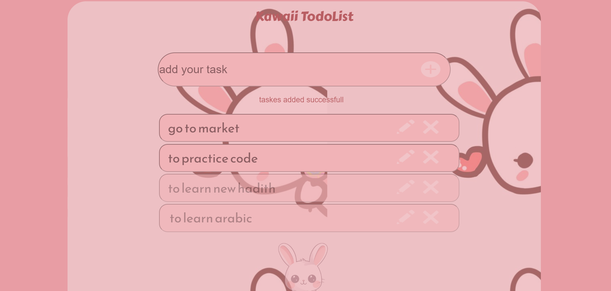

The Kawaii Todo List is a responsive web application designed to help users manage their tasks in a cute and visually appealing way. This project is inspired by a Figma design, focusing on a rounded, pink-themed interface that embodies a kawaii aesthetic. The layout is structured using HTML and styled with CSS to ensure a delightful user experience.

This task was not as easy as it seemed, particularly due to the specified dimensions. I faced difficulties when adding the background, which initially resulted in unexpected output.

Another challenge was incorporating the icons (+, x, and pencil) into the input text boxes. Achieving the right positioning and style took several attempts. While I thought the task would be straightforward, I learned that practical implementation often presents more difficulties than anticipated.

